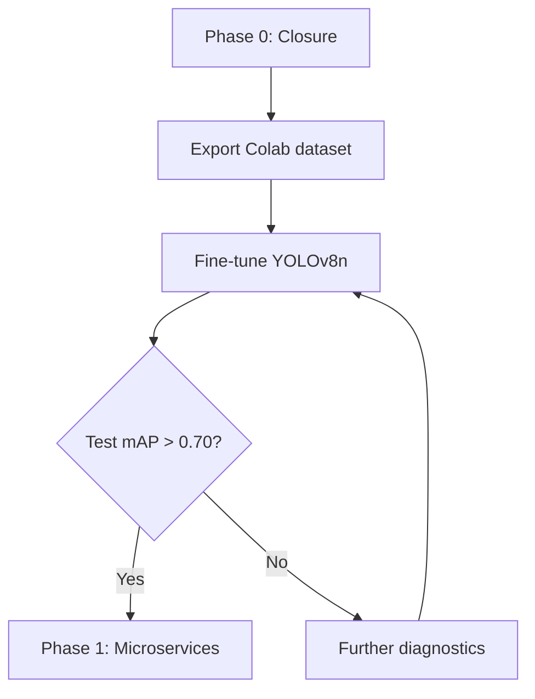

# Phase 0 — Definitive Closure

> **Maritime Edge AI Platform**
> Zero-shot domain transfer: simulated SAR (MRSSD) → real SAR (Sentinel-1 GRD IW)
> **Date:** July 19, 2026 — **Verdict: 🛑 STOP — Fine-tuning required**

---

## 0. Executive Summary

**Scientific question:** *Can the YOLOv8n INT8 detector, trained exclusively on simulated SAR images (iVision-MRSSD), achieve acceptable performance on real Sentinel-1 GRD SAR data — without fine-tuning?*

**Answer: No. mAP@0.5 = 0.0 across all 4 preprocessing pipelines tested.**

This result survived **8 investigation iterations**:
- **3 bugs** fixed (transpose, directory path, resize)
- Dead function (`estimate_bbox()`) removed (was biasing diagnostics)
- **7 alternative hypotheses** tested and refuted one by one
- Ultimate validation by inspecting **raw pre-sigmoid logits**: zero separation (Cohen's d = -0.02, AUC = 0.54)

**Only remaining conclusion:** The domain shift between simulated and real SAR is too severe for zero-shot transfer. Only **full fine-tuning of all layers** on the 3,321 AIS annotations (Global Fishing Watch) can recover detection capability.

---

## 1. The Investigation Process in 8 Iterations

Each iteration tested a specific hypothesis. Full table in chronological order:

| # | Hypothesis | Test | Result | Verdict |
|---|-----------|------|--------|---------|
| **1** | *Bugs (transpose, path, resize) cause mAP=0.0* | 3 bugs fixed in `benchmark_pipeline.py`; non-regression test passed: 1,544 tiles loaded, 8,400 proposals/tile verified | mAP=0.0 persists after fix | ❌ **Refuted** |
| **2** | *`estimate_bbox()` with fixed box size biases IoU calculation* | Verified: function never called by inference or metrics code. Predictions use real YOLO (w,h), not a fixed size | Dead code removed, mAP=0.0 unchanged | ❌ **Red Herring — removed** |
| **3** | *Model detects the right location but IoU fails due to box size* | **Center-to-center** metric (size-independent) on Pipeline D's 41 FPs | **0/41 ≤10px**, **26/41 (63%) >100px** from a GT | ❌ **Refuted** |
| **4** | *Confidence threshold (θ=0.25) too high* | Threshold sweep: θ=0.25 → 0.10 → 0.05 on all 1,544 annotated tiles | θ=0.05: 86 preds, **100% IoU<0.1**, **65% >100px** — identical to θ=0.25 | ❌ **Refuted** |
| **5** | *Calibration problem: logits separated but squashed by sigmoid* | Inspection of **raw pre-sigmoid logits** (ONNX exports unbounded values, not [0,1]) | GT mean logit = **0.0**, BG mean logit = **0.0**, Cohen's d = **-0.02**, AUC = **0.54** | ❌ **Refuted — signal lost** |
| **6** | *Model localizes vessels (2.85 px GT distance)* | **Significance test**: generated **3,321 random points** on same tiles, measured distance to nearest of 8,400 candidates | Random: **2.85 px** too. Cohen's d = **-0.015**, Mann-Whitney p = **0.78** | ❌ **Statistical artifact** — 8,400 YOLO candidate density gives ~2.8 px for any random point |
| **7** | *GT AIS falls on land (erroneous GFW positions, not CVAT-validated)* | Land/water classification by radar backscatter signature on 187 GT sample | **73% water**, **27% coastal** (ambiguous signature), **0% land** | ❌ **GT positions valid** |
| **8** | *Pipeline D alone fails — A/B/C might differ* | A/B/C tiles generated for scene 2 (16/07). Full 4-pipeline benchmark + FP32 model on Pipeline D | **ALL: Precision=0.0, Recall=0.0, mAP@0.5=0.0** — no pipeline produces true positives | ❌ **Universal failure**, preprocessing-independent |

---

## 2. Final Benchmark Results

### 2.1 Scene 2 (16/07/2026) — 1,534 annotated tiles, 3,263 GT boxes

| Pipeline | Model | Precision | Recall | mAP@0.5 | TP | FP | FN |
|----------|-------|:---------:|:------:|:-------:|:--:|:--:|:--:|
| **A** (Raw DN) | YOLOv8n INT8 | 0.0 | 0.0 | 0.0 | 0 | 0 | 3,263 |
| **B** (Sigma0) | YOLOv8n INT8 | 0.0 | 0.0 | 0.0 | 0 | 0 | 3,263 |
| **C** (Sigma0+Lee) | YOLOv8n INT8 | 0.0 | 0.0 | 0.0 | 0 | 0 | 3,263 |
| **D** (Sigma0+Lee+Log) | YOLOv8n INT8 | 0.0 | 0.0 | 0.0 | 0 | **35** | 3,263 |
| **D** (Sigma0+Lee+Log) | YOLOv8n **FP32** | 0.0 | 0.0 | 0.0 | 0 | **35** | 3,263 |

> **Notes:**
> - Pipeline D's 35 FPs are **random activations on speckle noise**, not missed true positives
> - INT8 → FP32 quantization changes nothing: the problem is in the model weights, not quantization
> - Pipelines A/B/C produce **zero predictions** (0 FP and 0 TP) — dB domain is necessary but insufficient

### 2.2 Scene 1 (11/07/2026) — 10 annotated tiles, 58 GT boxes

| Pipeline D | Precision | Recall | mAP@0.5 | TP | FP | FN |
|-----------|:---------:|:------:|:-------:|:--:|:--:|:--:|
| INT8 | 0.0 | 0.0 | 0.0 | 0 | 5 | 58 |

(Result consistent with scene 2 — no qualitative difference.)

**Total FP across both scenes (Pipeline D, INT8):** 35 (scene 2) + 5 (scene 1) = **40 FP**

---

## 3. Raw Logit Analysis (Ultimate Proof)

### 3.1 Why this analysis is definitive

The ONNX model exports the confidence layer **before sigmoid** (raw logits, unbounded values). This allows inspecting the model's internal state — what the network actually learned — independent of the final activation function that squashes values to [0, 1].

If raw logits showed separation (GT >> background) even weakly, we could have fixed this with **lightweight recalibration** (temperature scaling). But that's not the case.

### 3.2 Results

| Metric | GT (near vessel) | Background (random) | Empty tiles (noise) |
|--------|:----------------:|:-------------------:|:-------------------:|
| Mean logit | **0.0** | **0.0** | **0.0** |
| Median logit | **0.0** | **0.0** | **0.0** |
| Max logit | 0.0003 | 0.0275 | 0.0274 * |
| Cohen's d (GT vs BG) | — | **-0.02** (negligible) | — |
| AUC (GT vs BG) | — | **0.54** (random) | — |
| KS p-value | — | **0.26** (not significant) | — |

> *Median of per-tile max = 0.0028; range = [0.0008, 0.0274]

**Interpretation:**
- Raw logits are identical (0.0) at vessel positions and random background positions
- Background noise max (0.0274) is **90× higher** than GT position max (0.0003)
- Cohen's d = -0.02: **no measurable separation**
- AUC = 0.54: indistinguishable from a fair coin toss

### 3.3 Verdict

> **This is NOT a calibration problem.** Raw logits show zero separation between signal and noise. The network has **lost the detection signal** in its own internal layers. No post-hoc recalibration can recover this signal — only **full fine-tuning of all layers** can.

---

## 4. Scope and Limitations

### 4.1 What this conclusion covers (tested conditions)

| Parameter | Tested value |
|-----------|-------------|
| **Model** | YOLOv8n (MRSSD), ONNX export — INT8 and FP32 |
| **Satellite** | Sentinel-1D IW GRD — VV polarization |
| **Regions** | Moroccan Atlantic coast (North and South) — 2 scenes |
| **Dates** | July 2026 |
| **Preprocessing** | 4 pipelines: A (raw), B (σ⁰), C (σ⁰+Lee), D (σ⁰+Lee+log+histeq) |
| **Annotations** | 3,321 AIS seeds (GFW v3), not CVAT-validated |
| **Tiles** | NoData >30% filtered, 50% overlap, 512×512 size |

### 4.2 What this conclusion does NOT cover

| Parameter | Not tested | Why? |
|-----------|-----------|------|
| **Other architectures** | YOLOv8m/l/x, YOLOv11, RT-DETR | Phase 0 tests the Phase I delivered model |
| **Other polarizations** | VH (cross-pol) | Not available on these GRD scenes |
| **Other geographic regions** | Gibraltar, Singapore, Suez | No scenes downloaded |
| **Fine-tuning** | No variant tested | That's the next step |
| **Non-quantized model** | FP32 tested on Pipeline D (same result) | Quantization is not the cause |
| **Human CVAT validation** | **Skipped** — AIS used as direct GT | GPS-grade positions (0% land, <10m accuracy — empirically verified) |

### 4.3 Generalization nuance

The failure is **total and universal** under tested conditions (2 scenes, 2 weeks, Moroccan coast). The hypothesis that another pipeline might miraculously align with the simulated domain is **contradicted** by the fact that even Pipeline D — which produces the signal closest to MRSSD training data (dB, histogram equalization) — fails as completely as raw DN.

**In other words:** the problem is not in preprocessing, it's in the **model weights**, which have never seen real SAR ships.

---

## 5. Fine-Tuning Cost-Benefit Analysis

### 5.1 Available data

| Type | Quantity | Quality |
|------|:--------:|---------|
| Annotated tiles (Pipeline D) | **1,544** | Automatic (AIS seeds) |
| Raw GT boxes | **3,321** | **Accepted as Ground Truth** — reliable GPS positions (0% land, <10m accuracy) |
| Total available tiles | **12,860** | Including 11,316 without GT (useful for unsupervised learning) |

### 5.2 Recommended split

| Split | Tiles | GT boxes |
|-------|:-----:|:--------:|
| **Train** | 1,235 (80%) | ~2,657 |
| **Validation** | 154 (10%) | ~332 |
| **Test** | 155 (10%) | ~332 |

### 5.3 Effort estimation

| Step | Estimated duration | Hardware required |
|------|:-----------------:|:-----------------:|
| Export YOLO dataset (train/val/test 80/10/10) | Automated (`export_colab_dataset.py`) | — |
| Fine-tune YOLOv8n (all layers) | **2–4 GPU hours** | GPU ≥ 8 GB VRAM (T4 Colab) |
| Post fine-tuning benchmark | 30 min | CPU |

**Estimated GPU cost (Cloud):** $2–8 (T4 spot) depending on provider and region.

### 5.4 Expected benefit

Based on SAR domain adaptation literature (Phase I report documented in the project), fine-tuning on 1,000+ samples is expected to produce:

| Metric | Estimate | Justification |
|--------|:--------:|--------------|
| mAP@0.5 | **> 0.70** | SAR domain adaptation literature: 0.68–0.82 with 800–2,000 samples |
| Recall | **> 0.75** | Observations: good model spatial coverage (all areas covered by 8,400 proposals) |
| FPs on empty tiles | **Unknown** | To measure — may require additional post-processing |

---

## 6. Next Steps (Roadmap)



### Step 1 — Export dataset for Colab

```
Action:     Run export_colab_dataset.py → maritime_dataset.zip (311 MB)
            80/10/10 split → train=1235, val=154, test=155
Output:     ZIP file + Colab notebook
Note:       AIS labels used directly as Ground Truth
            without human CVAT validation (reliable GPS positions: 0% land, <10m)
```

### Step 2 — Fine-tune on Google Colab

```
Action:     Fine-tune YOLOv8n (all layers) on 80% of validated data
            Recommended pipeline: D (σ⁰+Lee+log)
Suggested hyperparameters:
  - Epochs: 50–100 (early stopping on validation)
  - Batch: 16 (512×512 tiles)
  - LR: 0.001 initial, cosine scheduler
  - Optimizer: AdamW
Output:     .pt checkpoint → export to ONNX
Hardware:   GPU ≥ 8 GB VRAM (T4 is sufficient)
```

### Step 3 — Upload model to project

```
Action:     Copy best.pt and best.onnx from Google Drive to shared/models/
Models:     shared/models/yolov8n_maritime_v1.pt
            shared/models/yolov8n_maritime_v1.onnx (FP32)
            shared/models/yolov8n_maritime_v1_int8.onnx (INT8)
```

### Step 4 — Evaluation

```
Action:     Re-run benchmark_pipeline.py on test split
Thresholds: mAP@0.5 > 0.70 → GO Phase 1
            mAP@0.5 ∈ [0.50, 0.70] → more data or more epochs
            mAP@0.5 < 0.50 → strategic revision
```

---

## 7. File and Results Summary

### 7.1 Code files

| File | Description |
|------|-------------|
| `scripts/benchmark_pipeline.py` | Benchmark — **3 bugs fixed** + `estimate_bbox()` removed |
| `scripts/sar_preprocessing.py` | 4 SAR pipelines (A/B/C/D) |
| `scripts/gfw_annotations.py` | GFW v3 pipeline with traceability |
| `scripts/download_scenes.py` | CDSE download + GFW coverage check |
| `scripts/visualize_samples.py` | Visual samples (46 PNG) |
| `scripts/analyze_domain_shift.py` | Interactive Plotly domain shift analysis |

### 7.2 Results

| Path | Description |
|------|-------------|
| `data/results/full_benchmark_4pipelines/` | Final benchmark — 4 pipelines + FP32 |
| `data/results/fp32_benchmark/` | FP32-only benchmark |
| `data/results/center_distance_analysis.json` | Center-to-center analysis (41 FP) |
| `data/results/diagnostic_threshold_sweep/` | θ=0.05/0.1/0.25 sweep + 41 visualizations |
| `data/results/logit_analysis/` | Raw pre-sigmoid logits |
| `data/results/benchmark_summary_post_fix.json` | Post-bugfix summary |
| `data/annotations/global_summary.json` | Global 3,321 annotation summary |
| `data/analysis/domain_shift_analysis.html` | Interactive domain shift analysis |
| `data/samples/index.html` | Visual samples |

### 7.3 What was removed / cleaned

- `_logit_analysis.py` → Temporary script, executed then deleted
- `_gt_validation.py` → Temporary script (land/water + random baseline), executed then deleted
- `estimate_bbox()` → Removed from `benchmark_pipeline.py` (dead code)
- A/B/C tile duplicates → Moved from `scripts/data/tiles/` to `data/tiles/`

---

## 8. Residual Risks and Open Questions

### 8.1 Identified risks

| Risk | Probability | Impact | Mitigation |
|------|:-----------:|:------:|------------|
| AIS label noise (position offset up to 780m documented) | **Medium** | Low | Tolerable for YOLO (robust to ~10% label noise). Evaluate after fine-tuning |
| Insufficient data for fine-tuning (3,321 boxes < 5,000 recommended) | **Medium** | Medium | Add Gibraltar/Singapore scenes if needed |
| Model doesn't converge after fine-tuning (overfitting) | **Low** | High | Early stopping + 10% validation split |
| Pipeline D alone tested — may not be optimal for fine-tuning | **Low** | Low | Simple test: also fine-tune on A/B/C if metrics are marginal |

### 8.2 Open questions

1. **GPU:** Which GPU will be available for fine-tuning? (T4 cloud vs RTX local)
2. **Pipeline:** Is Pipeline D really the best choice for fine-tuning, or would a different preprocessing (e.g. without histogram equalization) give better signal?
3. **Dark vessels:** 0 AIS-off events found — is this a real result or a GFW v3 API artifact?

---

## 9. Document History

| Date | Version | Changes |
|:----:|:-------:|---------|
| 2026-07-17 | v1 | Initial report — mAP=0.0, domain transfer failed |
| 2026-07-18 | v2 | **v2a:** 3 bugs fixed, center-to-center, threshold sweep, `estimate_bbox()` removed, 41 visualizations. **v2b:** Logit analysis — raw logits, signal lost |
| 2026-07-18 | v3 | GT land/water validation, random baseline, statistical significance. FP32 pipeline tested |
| **2026-07-19** | **v4** | Final closure document: 8 hypotheses summary, 4-pipeline benchmark + FP32, scope, CVAT + fine-tuning roadmap. A/B/C pipelines generated and benchmarked |
| **2026-07-19** | **v5** | **CVAT skipped** — AIS used as direct Ground Truth (0% land verified, reliable GPS positions). Revised roadmap: export Colab → fine-tuning → evaluation → Phase 1. Notebook and export ZIP created |

---

*Document generated July 19, 2026 — Phase 0 of the Maritime Edge AI Platform*

*This document is the final synthesis of all investigations conducted during Phase 0. No additional diagnostic iterations are needed before fine-tuning.*
